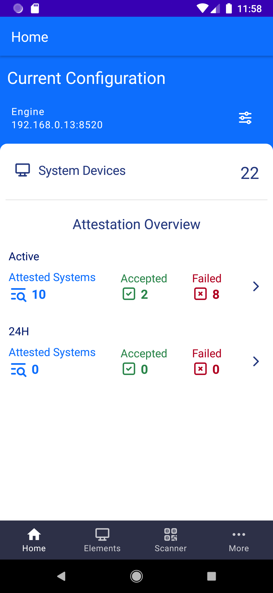
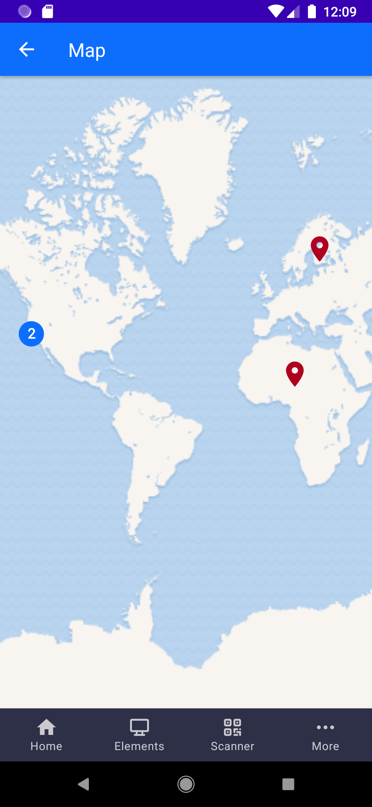

# Mobile Attesting App

Attesting and viewing devices with an android device allowing for easier management of multiple machines by leveraging a built-in camera and GPS.

 |  |  |  
 | :------ | :-------- | :-------- | :-------- 
 
* Attesting and managing devices remotely or on site. 
  *  **On-Site:** QR -codes containing device unique IDs can be placed on physical devices allowing for on site attestation and location fetching.
  *  **Remote:** Advanced device list filtering based on last attest result or device information.
* Map assistance for navigating between buildings using GPS.
* Global system overview

## Prerequisites

   * An attestation engine with [a10rest](../a10rest) running
   * (optional) [Trust agent](../t10) on each device for attesting the device

## (Optional) Configuration

There are no required configurations as the application will remember the list of attestation engines used in the past and will adhere to sensible defaults.


[gradle.properties](mobileattester/gradle.properties#L24-L39)

``` .properties

## MOBILE ATTESTER SPECIFIC PROPERTIES

# Default host to connect to when no host has been saved
# Only used on first install.
# Can be left default.
DEFAULTHOST=0.0.0.0

# Default port used when a new engine is added.
# Ignored if the port is explicitly specified "0.0.0.0:8533"
# Can be left default.
DEFAULTPORT=8520

# Number of elements to load in the background at the same time upon request
# Increasing the elements per batch may increase resource use.
# Can be left default.
BATCHSIZE=1
```
