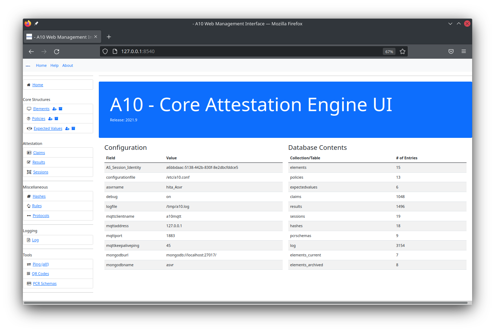
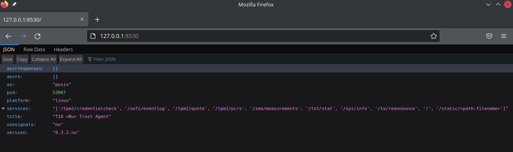

# Quick Start Installation

## Prerequisites

To run A10 you must have access to an MQTT broker, such as Mosquitto, and a Mongo Database. Typically these might be running locally.

## Local Installation

The installation will proceed in the following order. This will give you access to all the services provided in what we consider to be the A10 core engine.

   * Install a10structures libraries
   * Install a10server libraries
   * Configure a10.conf
   * Run the U10 user interface
   * Install a Trust Agent
   * Run the A10REST API

### Start here
Firstly ensure that you are in the correct base directory, eg:

```bash
ian@ubuntu:~/AttestationEngine$ ls -l
total 48
drwxrwxr-x 4 ian ian 4096 Ion  31 22:17 a10rest
drwxrwxr-x 8 ian ian 4096 Chw  27 13:43 a10server
drwxrwxr-x 8 ian ian 4096 Chw  27 13:43 a10structures
drwxrwxr-x 5 ian ian 4096 Tach 16 23:11 apps
-rw-rw-r-- 1 ian ian 1086 Tach 16 23:11 CONTRIBUTING.md
drwxrwxr-x 3 ian ian 4096 Chw  27 13:52 docs
-rw-rw-r-- 1 ian ian 1677 Tach 16 23:11 LICENSE
-rw-rw-r-- 1 ian ian 2022 Chw  27 13:48 README.md
drwxrwxr-x 8 ian ian 4096 Tach 29 15:56 t10
drwxrwxr-x 6 ian ian 4096 Chw  18 20:16 tests
drwxrwxr-x 5 ian ian 4096 Rha  12 13:19 u10
drwxrwxr-x 7 ian ian 4096 Ion  31 22:17 utilities

```

### Install a10structures Libraries
First go to the a10structures directory and run the script `reinstall` using sudo. This will perform 4 tasks: clear any pycache things, uninstall any existing a10structures libraries, build the libraries and then install them.

NB: some output snipped for brevity - this is the output of the python setup commands.

NB: if an existing installation is found, then you will be asked if you wish to remove it. This is a good place to hit Ctrl-C if anything seems to be going wrong.

```bash
ian@ubuntu:~/AttestationEngine/a10structures$ sudo ./reinstall
[sudo] password for ian: 
Found existing installation: a10structures 2022.2.18.2
Uninstalling a10structures-2022.2.18.2:
  Would remove:
    /usr/local/lib/python3.9/dist-packages/a10structures-2022.2.18.2-py3.9.egg
Proceed (y/n)? y
  Successfully uninstalled a10structures-2022.2.18.2
running sdist
running egg_info

...SNIPPED...

creating 'dist/a10structures-2022.2.18.2-py3.9.egg' and adding 'build/bdist.linux-x86_64/egg' to it
removing 'build/bdist.linux-x86_64/egg' (and everything under it)
Processing a10structures-2022.2.18.2-py3.9.egg
Copying a10structures-2022.2.18.2-py3.9.egg to /usr/local/lib/python3.9/dist-packages
Adding a10structures 2022.2.18.2 to easy-install.pth file

Installed /usr/local/lib/python3.9/dist-packages/a10structures-2022.2.18.2-py3.9.egg
Processing dependencies for a10structures==2022.2.18.2
Finished processing dependencies for a10structures==2022.2.18.2

```

Note, the version number might be different, but the final message should note that processing dependencies has been completed


### Install a10server Libraries
This is the same procedure as the a10structures. 

First go to the a10server directory and run the script `reinstall` using sudo. This will perform 4 tasks: clear any pycache things, uninstall any existing a10structures libraries, build the libraries and then install them. As a10server depends upon some python libraries, these will be automatically installed if required. A10server also depends upon a10structures.

NB: some output snipped for brevity - this is the output of the python setup commands.

NB: if an existing installation is found, then you will be asked if you wish to remove it. This is a good place to hit Ctrl-C if anything seems to be going wrong.

```bash
Found existing installation: a10server 2022.2.18.2
Uninstalling a10server-2022.2.18.2:
  Would remove:
    /usr/local/lib/python3.9/dist-packages/a10server-2022.2.18.2-py3.9.egg
Proceed (y/n)? y
  Successfully uninstalled a10server-2022.2.18.2
running sdist
running egg_info


...SNIPPED...


Finished processing dependencies for a10server==2022.2.18.2


```

Note, the version number might be different, but the final message should note that processing dependencies has been completed


### Configure a10.conf
The a10server libraries search for a file `/etc/a10.conf` which contains the configuration information for the system. Ensure this file exists using the example contents below:

```txt
[Identification]
asvrname =myAttestationEngine

[Debugging]
debug=on

[Logging]
logfile = /tmp/a10.log

[mqtt]
mqttclientname=a10mqtt
mqttaddress=127.0.0.1
mqttport=1883
keepaliveping=45

[mongo]
mongodburl=mongodb://localhost:27017/
mongodbname=asvr

```

The most important lines relate to the addresses and ports of the mqtt server (usually Mosquitto) and Mongo database. We assume here these are running on 127.0.0.1 or localhost, whichever is appropriate.


### Running the U10 User Interface
Go to the u10 directory and check the contents of the `u10.conf` file. This is used by python flask to start the web server. Example contents are below and these should be edited as required. Normally no changes are required.

The default port for u10 is 8540.

```txt
# Port on which to run U10 (default: 8540)
DEFAULTPORT = 8540
# Hosts on which to listen (default: 0.0.0.0)
DEFAULTHOST = "0.0.0.0"
# Debug mode for the flask app used for development to see errors and stack traces (default: True)
FLASKDEBUG = True
# Run in threaded mode to respond to more than one request at once (default: True)
FLASKTHREADED = True
```

To run u10, simply start it with python:

```bash
ian@ubuntu:~/AttestationEngine/u10$ python3 u10.py 
Configuration
   +-- configuration file:  /etc/a10.conf
127.0.0.1
mqtt client id is  a10mqtt_b9c85762-4db0-4370-8421-ca505b424510_8aca52b8-9c75-4b1d-a9cd-6a9f0b345cbf
Starting keep alive thead
Keep alive thread ID is  <Thread(Thread-1, initial)>
Starting keepalive ping with rate  45
ping!
U10 Starting
running
 * Serving Flask app 'u10' (lazy loading)
 * Environment: production
   WARNING: This is a development server. Do not use it in a production deployment.
   Use a production WSGI server instead.
 * Debug mode: on
Configuration
   +-- configuration file:  /etc/a10.conf
127.0.0.1
mqtt client id is  a10mqtt_a6bbdaac-5138-442b-830f-8e2dbcfddce5_0ad4b3dd-bd72-4162-ac00-a6565cb4b47f
Starting keep alive thead
Keep alive thread ID is  <Thread(Thread-1, initial)>
Starting keepalive ping with rate  45
ping!
U10 Starting
running

```

An occasional ping will be made to keep the mqtt connection open - this is set in `/etc/a10.conf` at around 45s. Mosquitto has a nasty habit of closing (and then not reopening) connections if they aren't used.

To stop u10, hit Ctrl-C a few times to kill u10 and the mqtt keep alive thread.

Now point your browser at the machine running u10, for example as below - note, this is showing a populated system.




### Install a Trust Agent

Go to the t10 directory and pick a suitable trust agent from there. For the quick start however we'll use `nut10`  (nu, as in new, and t10 as in, well t10...yes I know it looks like nut 10).

Go to the nut10 directory and edit the file `ta_config.cfg` which used by the python flask libraries. The default contents are below:

```bash
# Port on which to run the trust agent (default: 5002)
DEFAULTPORT = 8530
# Host on which to listen (default: 0.0.0.0)
DEFAULTHOST = "0.0.0.0"
# Debug mode for the flask app used for development to see errors and stack traces (default: True)
FLASKDEBUG = True
# Run in threaded mode to respond to more than one request at once (default: True)
FLASKTHREADED = True

```

The default port is 8530 for trust agents of this kind. There are other kinds and we'll worry about these later in the t10 documentation.

To run, simiarly to u10:

```bash
ian@ubuntu:~/AttestationEngine/t10/nut10$ python3 ta.py 
TA Starting
Defined Endpoints
/tpm2/credentialcheck
/uefi/eventlog
/tpm2/quote
/tpm2/pcrs
/ima/measurements
/txt/stat
/sys/info
/ta/reannounce
/
/static/<path:filename>
 * Serving Flask app 'ta' (lazy loading)
 * Environment: production
   WARNING: This is a development server. Do not use it in a production deployment.
   Use a production WSGI server instead.
 * Debug mode: on
 * Running on all addresses.
   WARNING: This is a development server. Do not use it in a production deployment.
 * Running on http://192.168.1.82:8530/ (Press CTRL+C to quit)
 * Restarting with stat
TA Starting
Defined Endpoints
/tpm2/credentialcheck
/uefi/eventlog
/tpm2/quote
/tpm2/pcrs
/ima/measurements
/txt/stat
/sys/info
/ta/reannounce
/
/static/<path:filename>
 * Debugger is active!
 * Debugger PIN: 987-645-211
```

You can check the status of nut10 by pointing your browser at port 8530 on this machine, for example:



Normally you'd never interact with a trust agent like this, but nut10 provides some JSON output about itself for convenience.


### Run the A10REST API
The pattern repeats itself with A10rest

Edit `a10rest.conf`, the default port is 8520 for the REST API and run using `python3 a10rest.py`

You can test using curl:

```bash
ian@ubuntu:~/AttestationEngine/a10rest$ curl -X GET http://127.0.0.1:8520/v2/
{
  "msg": "Hello from A10REST v2"
}
```

Note there are two APIs present, a version 1 and a version 2.  DO NOT USE the version 1 APIs as these are deprecated and contain errors. All calls to A10REST must use the `/v2` prefix to the requested HTTP endpoint.

